# 机能一览及流程图

## 主机能：通用识图

### 机能介绍

    用户通过拍照或者选择相册中的图片，上传到服务器进行识别。服务器通过Google Cloud Vision识别图片内容，返回给用户客户端并显示识别内容。

* 一般情况

    图片不包含特殊元素时，将如下例的样式显示结果。

    - 流程

        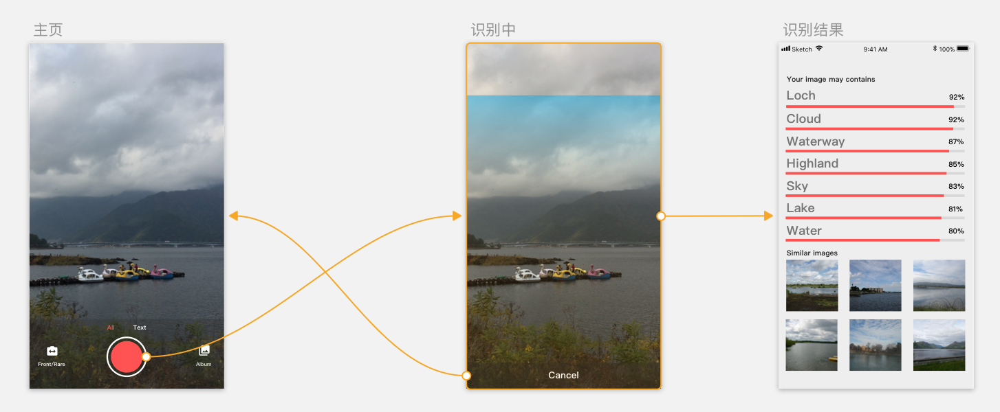

    - 主页

        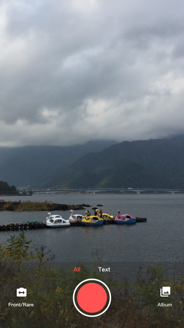

    - 识别中

        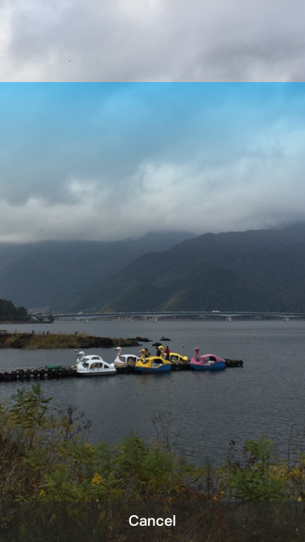

    - 识别结果

        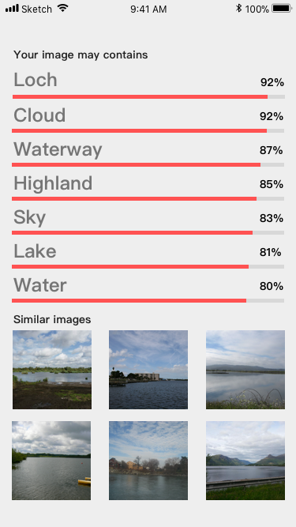

* 特性1

    如果图片包含日本常见景点，会有特殊显示方式，搜索结果页面会额外显示景点名称，景点基本介绍和常用属性（基于维基百科Meta）。点击常用属性会链接到维基百科。

    - 流程

        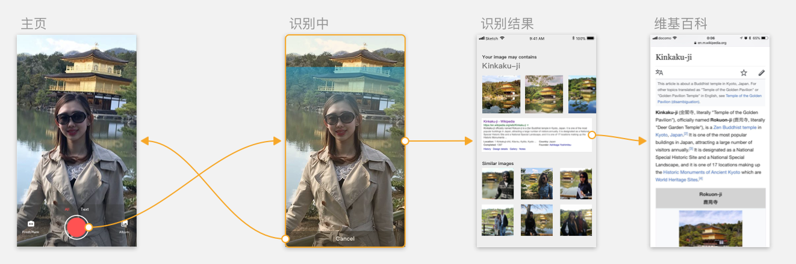

    - 主页

        

    - 识别中

        

    - 识别结果

        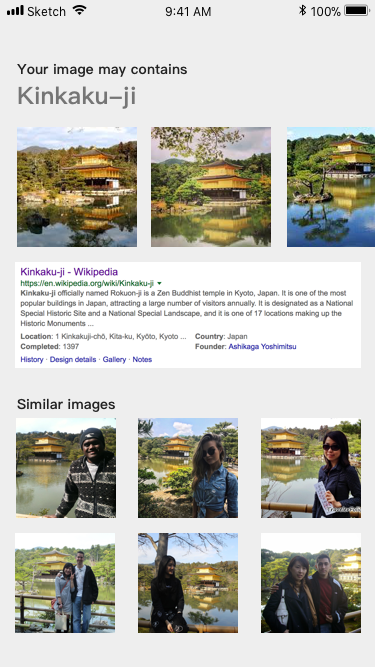

    - 维基百科

        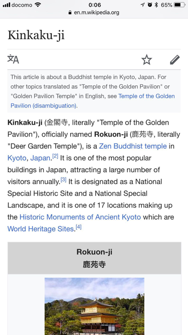

## 主机能：文字识别

### 机能介绍

    用户通过拍照或者选择相册中的图片，上传到服务器进行识别。服务器通过Google Cloud Vision识别图片文字，然后用Google Translate进行翻译。最后将结果返回用户客户端进行显示。

* 一般情况

    成功识别到图片中的文字。

    - 流程

        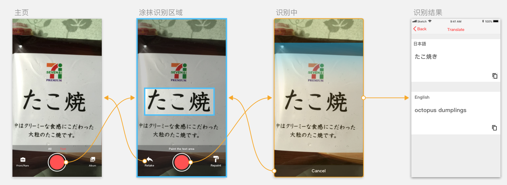

    - 主页

        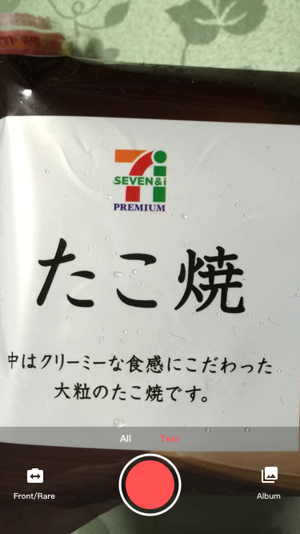

    - 涂抹识别区域

        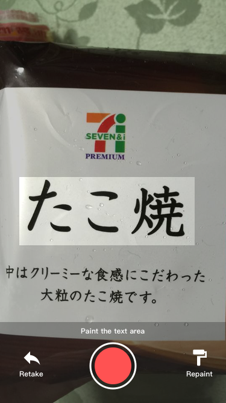

    - 识别中

        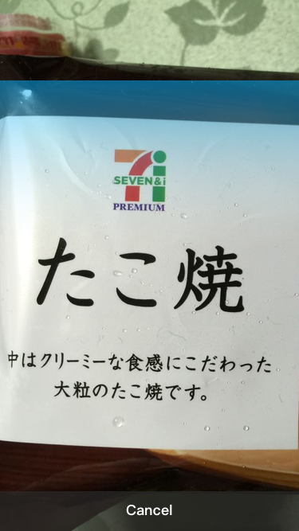

    - 识别结果

        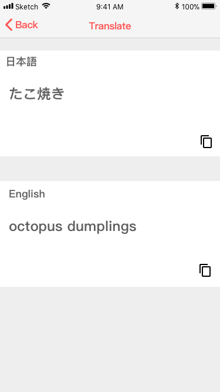

* 异常情况

    无法识别图片中的文字。

    - 流程

        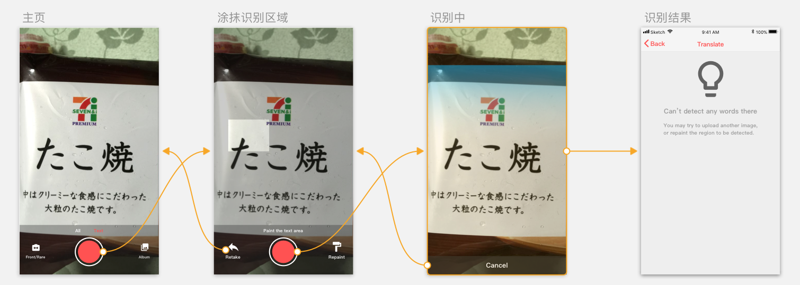

    - 主页

        

    - 涂抹识别区域

        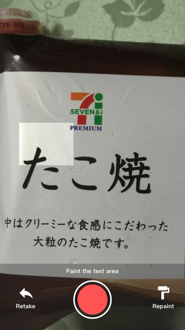

    - 识别中

        

    - 识别结果

        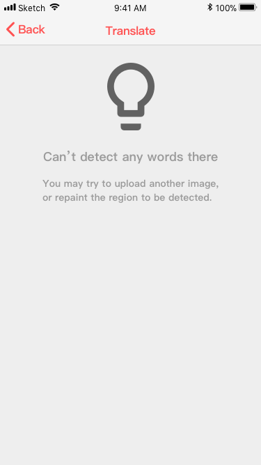